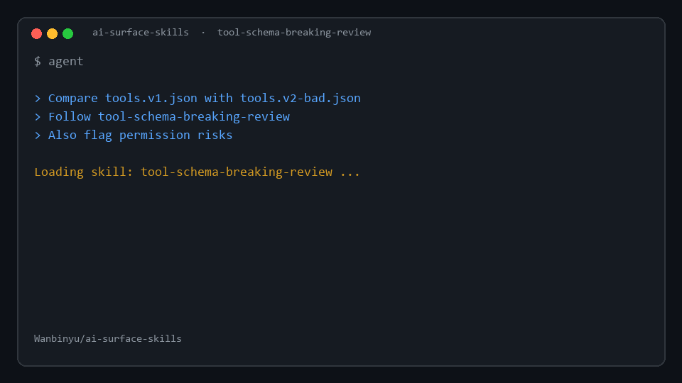
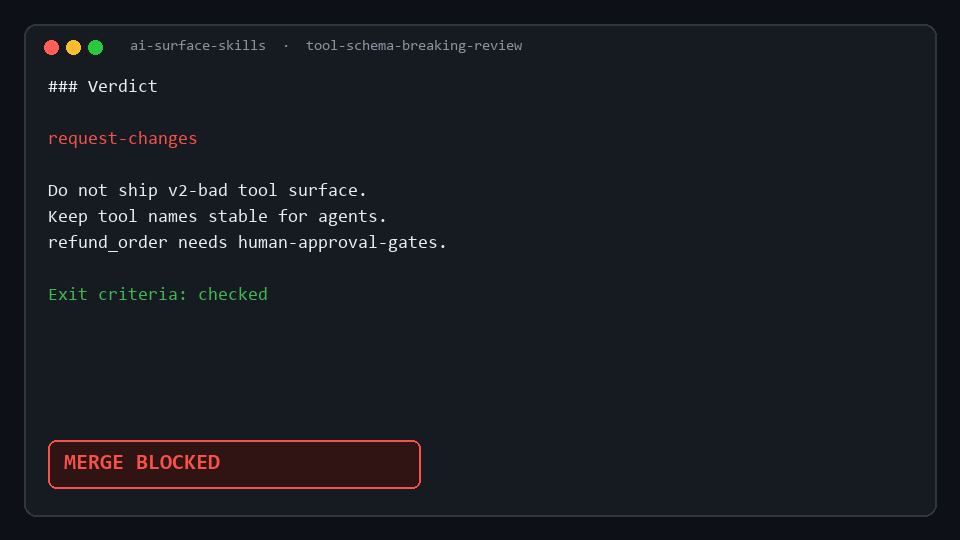

# AI Surface Skills

<p align="center">
  <strong>HTTP contracts evolve. Tool contracts should too.</strong>
</p>

<p align="center">
  Agent Skills for <em>tool / MCP / function-calling surfaces</em> — design, evolution, permissions, human gates, eval.<br/>
  Not another MCP server Hello World.
</p>

<p align="center">
  <a href="LICENSE"></a>
  <a href="https://github.com/agentskills/agentskills"></a>
  
  
</p>

<p align="center">
  <a href="#install">Install</a> ·
  <a href="#skills">Skills</a> ·
  <a href="#demo">Demo</a> ·
  <a href="docs/NOT-ANOTHER-MCP-BUILDER.md">vs mcp-builder</a> ·
  <a href="docs/SOCIAL.md">share copy</a> ·
  <a href="docs/PUBLISH-TOMORROW.md">publish tomorrow</a>
</p>

<p align="center">
  
</p>

<p align="center"><sub>Demo: <code>tool-schema-breaking-review</code> on <code>tools.v1</code> → <code>tools.v2-bad</code> → <strong>MERGE BLOCKED</strong></sub></p>

---

## Sister pack

| Pack | Surface |
|------|---------|
| [api-platform-skills](https://github.com/Wanbinyu/api-platform-skills) | HTTP / OpenAPI for humans & SDKs |
| **ai-surface-skills** (this) | Tools / MCP for **agents** |

Compose both. Do not mix REST naming tutorials into this repo.

---

## What you get (MVP)

**9 skills** (1 router + 8 content):

| Skill | Job |
|-------|-----|
| [`using-ai-surface-skills`](skills/using-ai-surface-skills/SKILL.md) | Router + ship-check |
| [`tool-contract-design`](skills/tool-contract-design/SKILL.md) | Design clear tool contracts |
| [`tool-schema-breaking-review`](skills/tool-schema-breaking-review/SKILL.md) | Breaking change review for tools |
| [`tool-idempotency-and-retries`](skills/tool-idempotency-and-retries/SKILL.md) | Side effects under agent retries |
| [`tool-permission-matrix`](skills/tool-permission-matrix/SKILL.md) | Blast radius & least privilege |
| [`human-approval-gates`](skills/human-approval-gates/SKILL.md) | When humans must confirm |
| [`mcp-tool-surface-review`](skills/mcp-tool-surface-review/SKILL.md) | Review existing MCP tool lists |
| [`skill-vs-mcp-choice`](skills/skill-vs-mcp-choice/SKILL.md) | Skill vs MCP decision tree |
| [`agent-tool-eval`](skills/agent-tool-eval/SKILL.md) | Minimal tool-use eval harness |

Each skill has: triggers, steps, **exit criteria**, anti-patterns, output template.

---

## Install

### Claude Code (recommended)

```powershell
# Windows
git clone https://github.com/Wanbinyu/ai-surface-skills.git
cd ai-surface-skills
.\scripts\install.ps1 -Claude
```

```bash
# macOS / Linux
git clone https://github.com/Wanbinyu/ai-surface-skills.git
cd ai-surface-skills
chmod +x scripts/install.sh
./scripts/install.sh --claude
```

Writes to `~/.claude/skills/`. **Restart Claude Code.**

### Plugin marketplace

```text
/plugin marketplace add Wanbinyu/ai-surface-skills
/plugin install ai-surface-skills@ai-surface-skills
/reload-plugins
```

### Project-local

```powershell
.\scripts\install.ps1 -Project
```

More: [docs/CLAUDE.md](docs/CLAUDE.md)

---

## Demo

<p align="center">
  
</p>

| Fixture | Role |
|---------|------|
| [`examples/toy-tools/tools.v1.json`](examples/toy-tools/tools.v1.json) | Shipped baseline |
| [`examples/toy-tools/tools.v2-bad.json`](examples/toy-tools/tools.v2-bad.json) | Silent breaks + unsafe refund |
| [`examples/sample-reports/tool-breaking-v1-vs-v2-bad.md`](examples/sample-reports/tool-breaking-v1-vs-v2-bad.md) | Golden report |
| [`assets/demo-tool-break.gif`](assets/demo-tool-break.gif) | Animated walkthrough |

```text
Compare examples/toy-tools/tools.v1.json with tools.v2-bad.json.
Follow tool-schema-breaking-review. Give a merge verdict.
Also run tool-permission-matrix on v2-bad.
```

---

## Not this pack

| Do | Don't |
|----|--------|
| Tool contract discipline | FastMCP / MCP SDK hello world |
| Review tool surfaces | Product-specific "how to use X MCP" |
| Agent retry / permission / HITL | Red-team exploit packs |
| Minimal tool-use eval | Full ML platform |

Details: [docs/NOT-ANOTHER-MCP-BUILDER.md](docs/NOT-ANOTHER-MCP-BUILDER.md)

---

## 3-day GitHub ship

See **[docs/SHIP-3DAY.md](docs/SHIP-3DAY.md)** — local complete now; public release in three days.

---

## License

MIT · [Wanbinyu](https://github.com/Wanbinyu)

---

## One skill = one project (optional)

Prefer installing a **single skill**? Each skill is also exported as a standalone project under `G:\skill\solo\<name>` and can be published as `skill-<name>` on GitHub.

- Local catalog: `G:\skill\solo\CATALOG.md` / `G:\skill\SOLO-MODEL.md`
- Bulk install: this collection repo (all skills at once)

